# Project: HKT Mobile

## Introduction
Group08_Thầy ơi cứu em   
Member: 
Trần Phú Khang (SE171361) 
Nguyễn Sĩ Vạn Hào (SE172181)  
Nguyễn Hoàng Thiên (SE182297)
Test

## 1.REQUIREMENTS 
* **Name of system:** HKT Mobile
 
* **Purpose:** At HKT mobile' s website, we've designed an array of features to simplize the shopping journey for our customers. Our website showcases a diverse array of top-tier smartphones. Each product listing boasts detailed specifications and user feedback, empowering shoppers to make well-informed decisions. Our transparent pricing model ensures clarity, fostering trust and contentment among our clientele. Furthermore, our intuitive interface simplifies browsing and purchasing, enabling users to effortlessly create accounts, manage their carts, and review pricing details. Moreover, our website hosts a dedicated FAQ section to address common queries, ensuring that customers have ready access to essential information.

* **Object:** This system was created for the customers who is interested in our products and the admins manage the website. 

### Customers:
    
   *  REGISTER  : user can enter username and password, their personal information like address, phone number, name to create account.
    
   *  LOG IN/ LOG OUT  : customer can log in a registered account and log out whenever they want.

   *  SEARCH : they can search products by name and see those products clearly.

   *  VIEW : they can see the details of the products they are looking for (pictures, description, reviews), moreover , they can see MODEL and LATEST PRODUCTS.
   
   *  ACCOUNT INFORMATION : they can check their information and can change if something is wrong, especially they can also change their password.
   
   *  SHOPPING CART : user can add products and remove when they don't need to buy this item anymore.
   
   *  CHECK OUT  : Users will see the amount they need to pay for each items they ordered and the total amount due for their final payment.   
   
   *  CLIENT'S FEEDBACK : customers can give the feedback about the products or check what others thinks about the product that they are interested in.

   *  CONTACT   : customer can contact with admin for FAQ.   

   * ORDER LIST   : user can view order history and cancle if status of order is not confirmed
### Admin

  *  LOG IN/ LOG OUT  : Admin can log in with a separate account for admin to access to home page with salemanship's functions and log out when they are finished.

  *  PRODUCT MANAGEMENT :Admins are responsible for managing products which includes adding, updating, deleting, and viewing them.

  *  BRAND MANAGEMENT :Admins can oversee brand information, allowing them to add, update, delete, and view brand details.

  *  USER MANAGEMENT :Admins can handle user data by adding, updating, deleting, and viewing user profiles.

  *  INVOICE MANAGEMENT : Admin can view the message of user to contact them.

  
## 2.GUI
#### USER
* Log in 
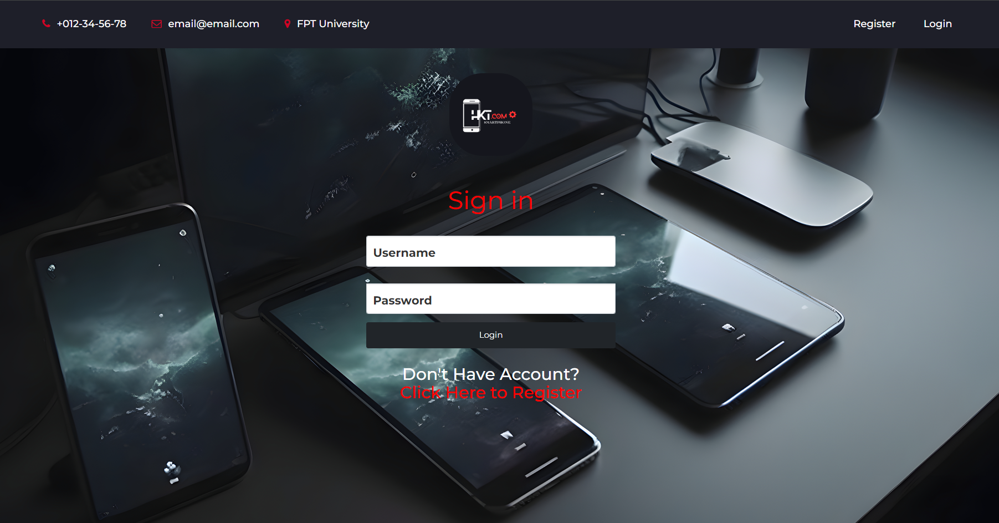
* Create account 
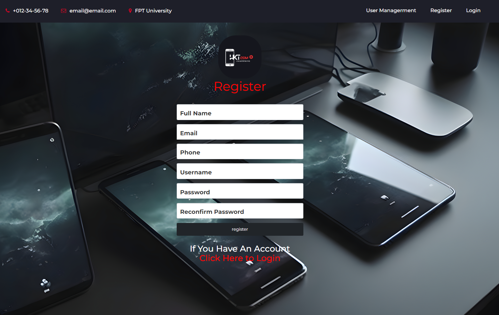
* Homepage 
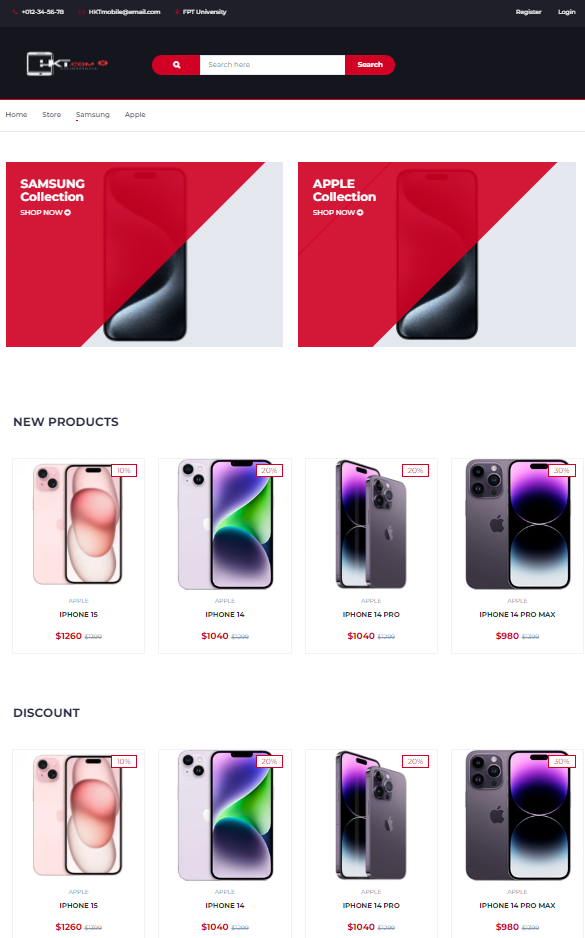
* Store 
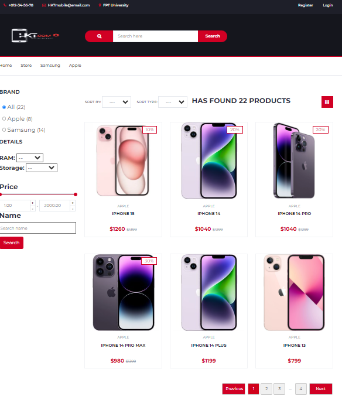
* Product details 
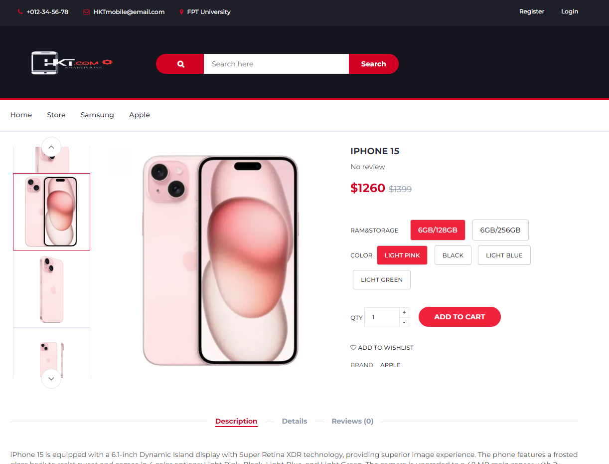
* Cart 
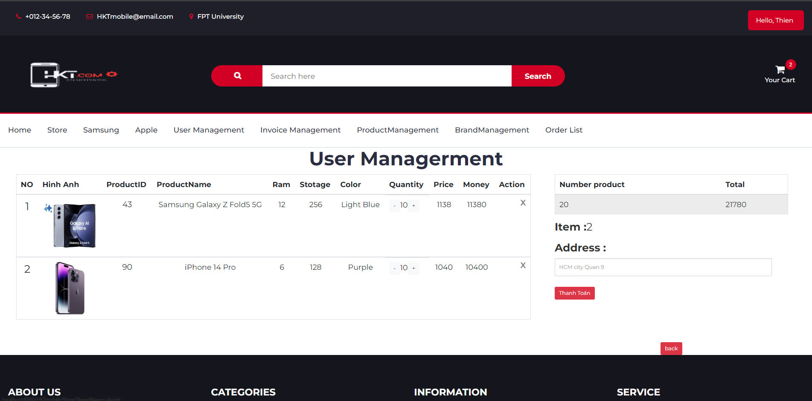
#### Admin
* Manage Product 
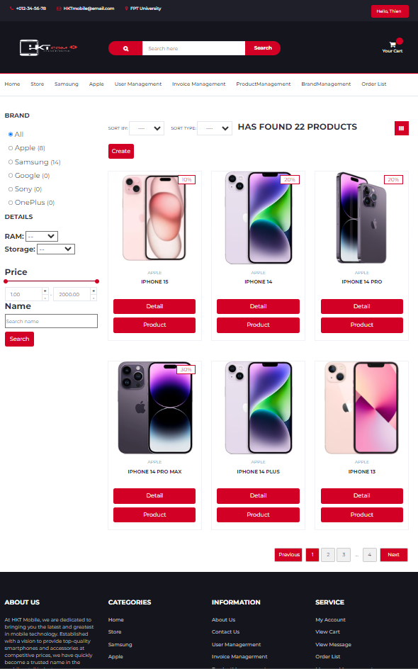
* Product Group 
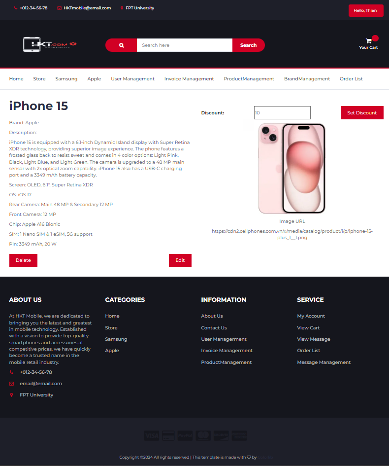
* Product-CRUD 

* Manage User 
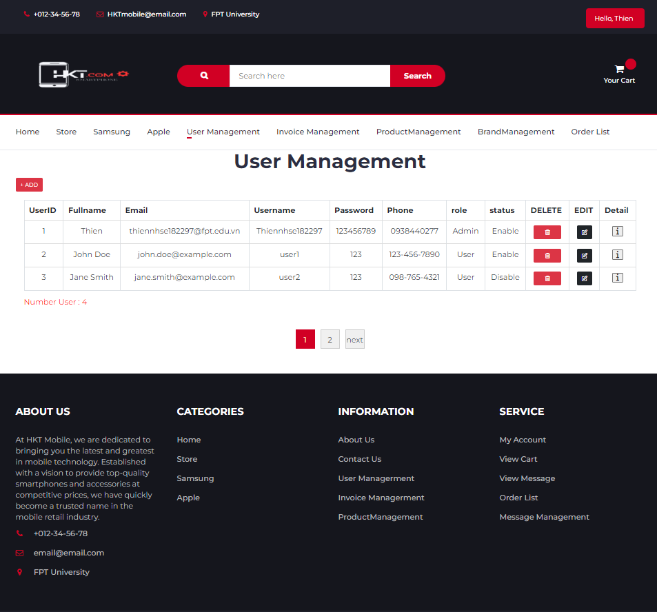
* Manage Invoice 
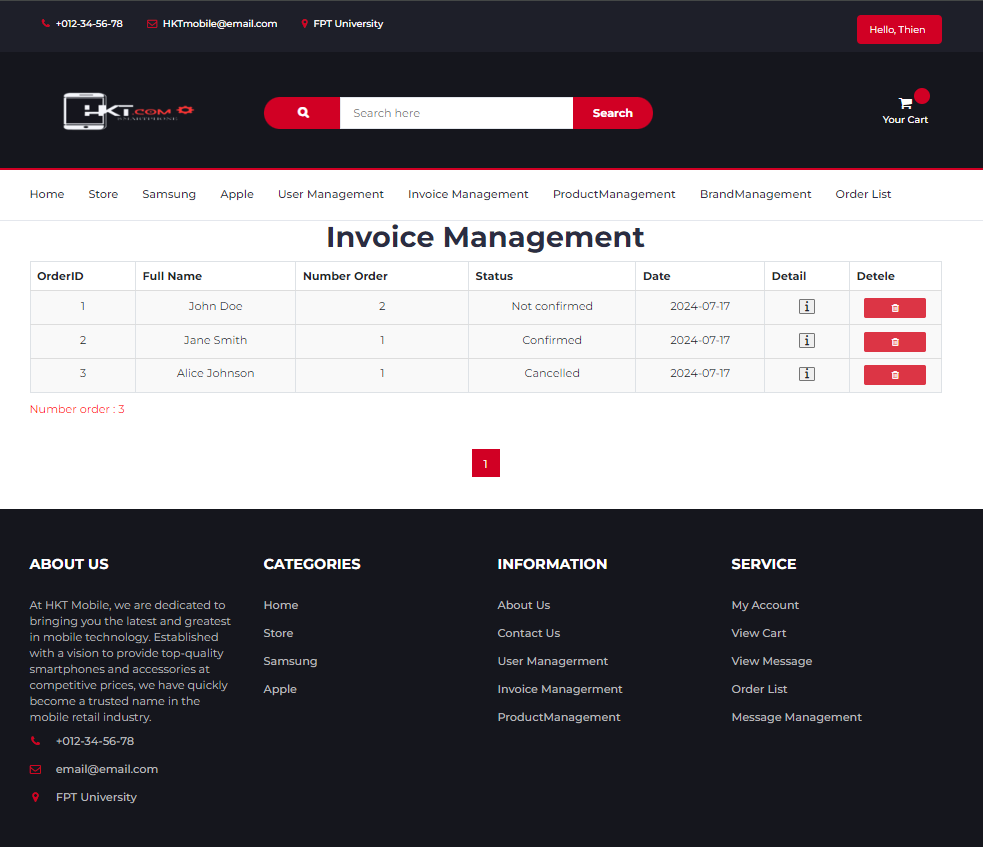
* Manage Brand 
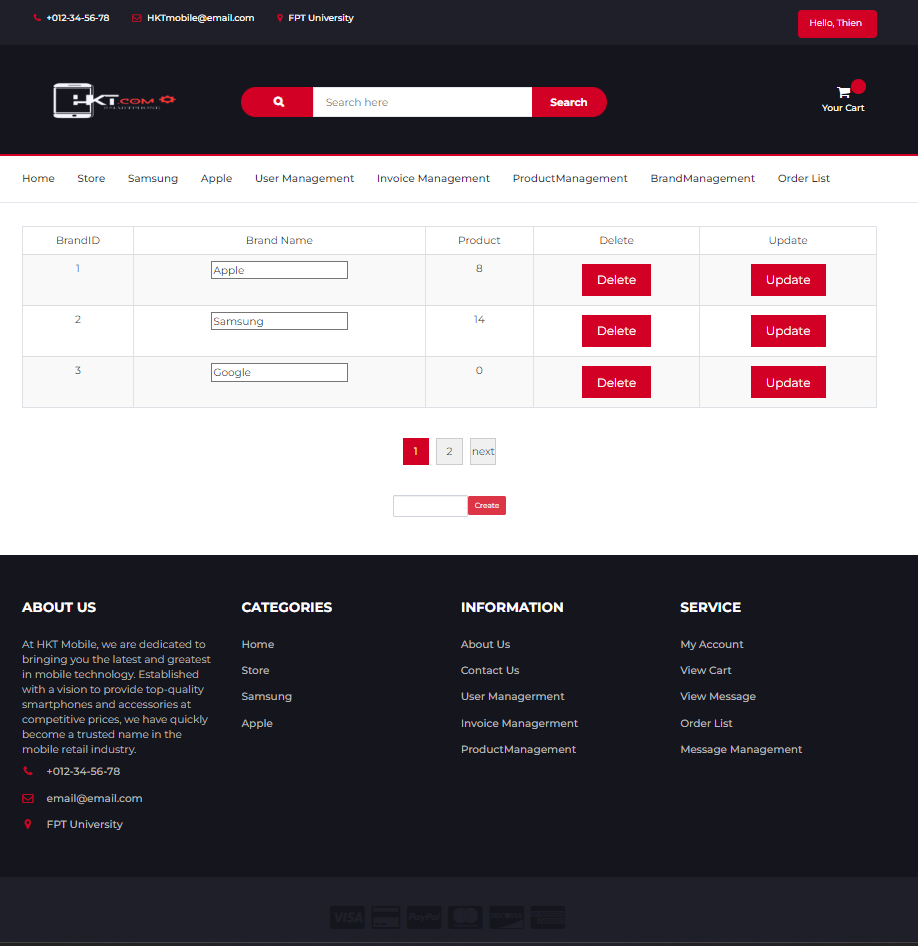

## 3.DATABASE
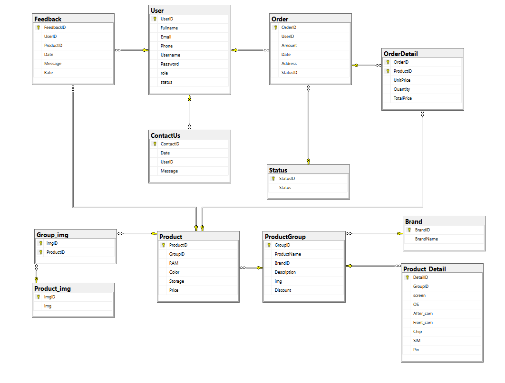

## 4. SYSTEM DESIGN

* VIEW 
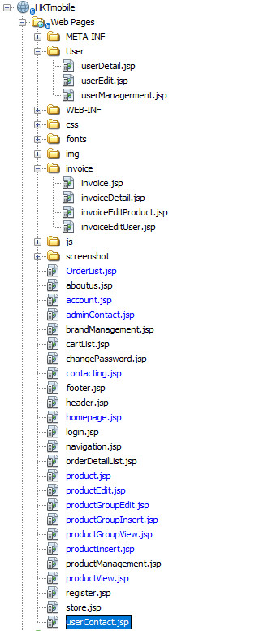
* CONTROLLER 
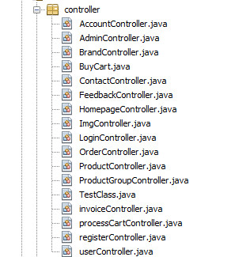
* MODEL 
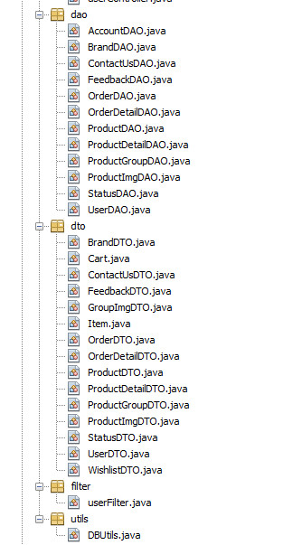

* Flow chart
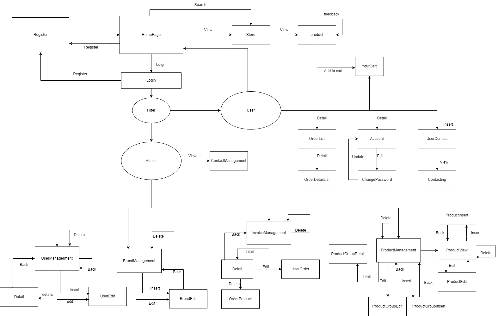

## 5.CONCLUSION & DISCUSSION 
 
* **Pros:**
    + Ensuring basic functionalities for an online shop website.
    + Pagination - displays products.
    + Send message to admin of the website.
    + Update and edit account information.
* **Cons:**
    + Security for admin is still a bit lax, anyone can log in if they have username and password.
    + GUI is not good
    + Every action need to refresh 
### **What we learned:**
  - Applying MVC2 (Model-View-Controller) to develop the web application.
  - Work is clearly divided for each person:
    + Hào: Contact us function, order list, account, change password, update account information.
    + Khang: Do login, register, shopping cart functions, user management, invoice management, filter.
    + Thiên: database,insert information into the database, product management, display and search product, Homepage.  
 - Learning how to research and troubleshoot errors effectively during the work process is essential for continuous improvement and problem-solving.
### **Improvement in Application:**
* Emphasizing more on web design techniques that deliver a better user experience.
* Enhancing the website's security to provide better protection.
* Learning and researching additional advanced features or incorporating missing functionalities into the developing website.
### Message
* Hào: Through this assignment, I developed a sense of responsibility towards my tasks and, more importantly, acquired the skills to create and manage an e-commerce website with comprehensive features for both users and admins.
Additionally, my database (SQL) skills are still weak when dealing with complex syntax. Lastly, I want to thank the teacher and my team members for their support during the learning process and for helping me complete this assignment.
* Khang: Through this assignment, I know more about the methods that websites must handle, how to make a complete website. To be able to give users and administrators how to communicate and implement. How to create a shopping cart and how to manage it.
* Thiên: This assignment has helped me learn how to work as a team on a project. Through it, I have gained a better understanding of how websites operate and how to design the basic features of an e-commerce site. Despite encountering some difficulties, our team worked hard to overcome them and complete this assignment.